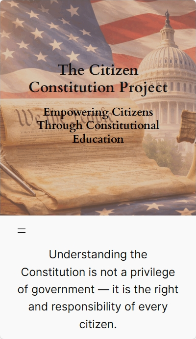
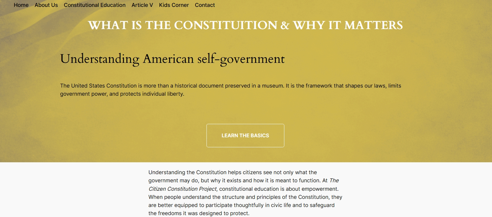

# The Citizen Constitution Project

## Overview
The Citizen Constitution Project is a founder-led civic education initiative designed
to make constitutional knowledge more accessible, understandable, and engaging for
the general public.

The project emphasizes clarity, nonpartisan education, and real-world understanding
of constitutional processes, with content designed for adults, families, and students.

## Project Scope & Vision
This project was developed as a long-term educational platform rather than a static
marketing website. The scope includes public-facing educational content, structured
learning sections, and future interactive features intended to support civic literacy
across different age groups.

## Project Goals
- Make constitutional education more accessible to non-experts
- Present complex civic processes in clear, plain language
- Encourage informed, lawful, and peaceful civic participation
- Design content suitable for both adults and younger audiences
- Build a platform that can grow over time without redesigning core structure

## Screenshots

### Home Page (Desktop)
The homepage introduces the project’s mission, values, and structure, providing clear navigation and a strong visual identity.

---

### Home Page (Mobile)
The site is fully responsive, with layouts and navigation optimized for mobile devices.

---

### About Page
The About page explains the purpose, independence, and guiding principles of The Citizen Constitution Project.

---

### Constitutional Education
This section presents foundational constitutional concepts in a clear, structured, and accessible format.

## Technologies & Platform
- WordPress (block editor)
- HTML / CSS customization
- Responsive design principles
- Accessibility-conscious layout decisions

## Design & Content Approach
- Education-first, nonpartisan tone
- Plain-language explanations
- Calm, readable visual hierarchy
- Age-appropriate content separation (general audience vs. kids sections)

## Challenges & Tradeoffs
- Balancing depth of information with readability
- Designing civic content without political framing
- Structuring long-form educational pages for usability
- Planning for future interactive features while keeping the current site simple

## Future Roadmap
- Interactive state-by-state educational content
- Expanded kids-focused learning materials
- Downloadable teaching resources
- Additional accessibility improvements

## Disclaimer
This project is an independent educational initiative.
It is not affiliated with any government agency, political party, or advocacy group.

## Author
Aaron Williams  
Founder & Web Developer

This project was created to demonstrate long-term project ownership, educational UX
design, and practical front-end decision-making.
